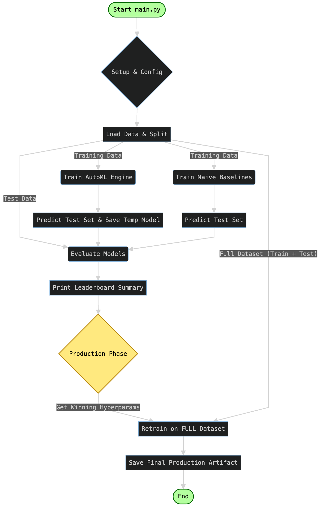

# Part 1: M4 Forecasting Pipeline

## 📖 Overview

This project implements an end-to-end Machine Learning pipeline for Time Series Forecasting using the M4 competition
dataset. It demonstrates a robust workflow comparing modern **AutoML techniques** (utilizing LightGBM/Optuna) against
strong **Statistical Baselines** (Seasonal Naive).

Key features of this pipeline include:

* **Data Loading:** Efficient handling of M4 dataset splits.
* **AutoML Training:** Hyperparameter optimization using Optuna.
* **Benchmarking:** Comparison against `StatsForecast` baselines (SeasonalNaive).
* **Evaluation:** rigorous metric calculation (MAE, SMAPE, MASE) via `utilsforecast`.
* **Productionization:** Retraining on the full dataset and artifact serialization.

## 🚀 Setup & Installation

### Option A: Local Setup (Conda)

#### 1. Create the environment:

```Bash

conda env create -f ./setup/conda_env.yml
conda activate ts_docker_fastAPI
```

#### 2. Run the pipeline:

```Bash
python main.py --horizon 24 --freq H
```

### Option B: Docker Setup (Recommended via Compose)

We use **Docker Compose** to manage the build and runtime arguments automatically. This ensures you don't need to type
long
commands to mount volumes or set environment variables.

#### 1. Build and Run: The following command will build the image (if it doesn't exist) and start the container.

```Bash
docker compose up --build
```

#### 2. View Output:

The logs will stream directly to your terminal. You will see the AutoML optimization, baselinegeneration, and the final
leaderboard.

#### 3. **Stop the application**:

Press Ctrl+C to stop the execution, or run:

```bash
docker compose down
```

## 📊 Pipeline Workflow



# Part 2: Introduction to Docker for Data Science

## 🐳 What is Docker?

In Data Science, "it works on my machine" is a common problem. One student might have a different version of Python,
pandas, or a different OS (Windows vs. Mac) than another, causing the code to break.

**Docker** solves this by packaging the code and its dependencies together. It creates an isolated environment so the
application runs consistently everywhere.

### Core Concepts

#### 1. The Dockerfile

* A text document containing all the commands to assemble an image.
* Example: "Start with Python 3.10, install pandas, copy my code files."

#### 2. The Image

* An immutable (unchangeable) snapshot created from the Dockerfile. It contains the code, libraries, and runtime.
* Analogy: In Object-Oriented Programming, the Image is the Class.

#### 3. The Container

* A runnable instance of an Image. You can start, stop, move, and delete it.
* Analogy: In Object-Oriented Programming, the Container is the Object.

#### 3. Docker Compose (The Orchestrator)

* A tool for defining and running multi-container applications (e.g., one container for your Python script, another for
  a
  SQL database). It uses a YAML file to configure the services.

### 🛠 Docker Cheat Sheet

Here are the essential commands you will use in this course:

#### 1. Build: Create an image from your source code.

```Bash
# -t names the image 'my-app'
# . tells docker to look for the Dockerfile in the current directory
docker build -t my-app .
```

#### 2. Run: Start a **container** from an **image**.

```Bash
# --rm: Automatically remove the container when it exits
# -it: Interactive terminal (allows you to see print statements)
docker run --rm -it my-app
```

#### 3. List Processes (ps): See what is currently running.

```Bash
docker ps # Shows running containers
docker ps -a # Shows ALL containers (including stopped ones)
```

#### 4. Exec

Enter a running container to debug (like SSH-ing into a virtual machine).

```Bash
# First, get the Container ID from 'docker ps'
docker exec -it <container_id> /bin/bash
```

#### 5. Stop & Remove

```Bash
docker stop <container_id>  # Gracefully stop
docker kill <container_id>  # Force stop
docker system prune # Clean up unused images and stopped containers
```

## 🐙 What is Docker Compose?

While Docker runs a single container, Docker Compose is a tool for defining and running multi-container applications.
Even for single-container projects (like this one), it is highly preferred because it acts as a configuration file for
your run command.

### 🛠 Docker Cheat Sheet

#### Build & Run (Compose)

The standard workflow for most projects.

````Bash

# Build the image and start the container
docker compose up --build

# Run in "detached" mode (in the background)
docker compose up -d
````

#### Inspection (PS & Logs)

Check what is running.

```Bash
# Show currently running services
docker compose ps

# View the logs of a background container
docker compose logs -f
```

#### Execution (Exec)

Enter a running container to debug (like SSH-ing into a virtual machine).

```Bash
# 'app' is the service name defined in docker-compose.yml
docker compose exec app /bin/bash
```

#### Teardown

```Bash
# Stop containers and remove networks
docker compose down
```

## 🔌 Key Configuration: Ports & Volumes

Two critical concepts control how your container interacts with the outside world (your laptop):

### Volumes (The Shared Folder):

* **Problem**: Containers are temporary. If you train a model and the container stops, your saved model file is deleted
  forever.
* **Solution**: Volumes. They map a folder on your laptop (Host) to a folder inside the container.

In this project: We use a volume to ensure the engine.save() command saves the model to your actual hard drive, not just
inside the disposable container.

### Ports (The Doorway):

* **Problem**: By default, you cannot access web servers running inside a container.
* **Solution**: Ports. You "bind" a port. For example, mapping 8089:8089 allows you to open Jupyter Notebooks running
  inside Docker on your laptop's browser.

# Part 3: Model Serving

## ⚡ FastAPI & Uvicorn

To serve our forecasting model as a real-time API, we use two key technologies:

* **FastAPI**: A modern, high-performance web framework for building APIs with Python. It provides automatic validation
  and interactive documentation (Swagger UI).
* **Uvicorn**: A lightning-fast ASGI (Asynchronous Server Gateway Interface) server. While FastAPI defines what the API
  does, Uvicorn is the engine that runs it and handles the network connections.

## 🚀 Running the API

You can start the server directly from the terminal with the following command:

```
uvicorn app:app --app-dir src --reload --host 0.0.0.0 --port 8080
```

Command Breakdown:

* `app:app`: Tells Uvicorn to look for a file named app.py and an instance named app inside it.
* `--app-dir src`: Specifies that the application code is located inside the src directory.
* `--reload`: Enables auto-reload. The server will automatically restart when you save changes to the code (perfect for
  development).
* `--host 0.0.0.0`: Binds the server to all network interfaces, making it accessible from outside the container.
* `--port 8080`: Runs the server on port 8080.
